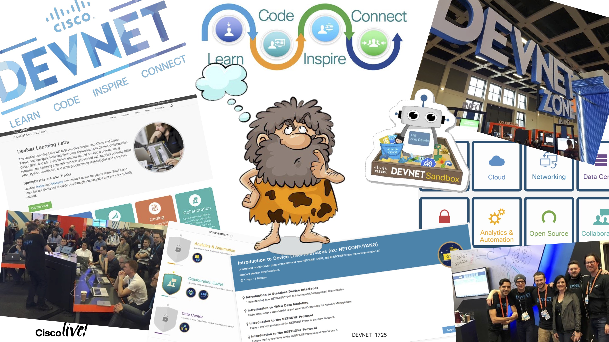

# DevNet Norway Community

This is the new landing site for the DevNet Norway Community.
We'll use this to collect the information, presentations and code we used during our meetups.

We'll be adding the previous content but will start with the last one from 15th November.

## DevNet Community November 2023

### Agenda

17:00 – 17:10 Welcome –Arjan Toxopeus

17:10 – 17:55  Tech Session – The Journey - Building a SuperCloud using Infrastructure as Code - Speaker: Arjan Toxopeus - Cisco Norge

18:00 – 18:05  Break

18:05 – 18:15  Tech Session – AI infrastructure details.

18.15 - 18:55  Tech Session - Network Operations in the Age of Artificial     Intelligence - Speaker: John Capobianco- Developer Advocate    Cisco

18.55 – 19.00  Close/Next gathering

19:00 – XX:XX  Skråplanet

### Recording

The recording can be found here:

<https://app.vidcast.io/share/f9193c04-d3eb-4309-89bb-97ddf34df5c3>

### Slidedeck

The slidedeck from the general part can be found here:

<https://github.com/atoxopeu/DevNetNorwayCommunity/blob/main/DevNet-Community2023%232.pdf>

Regards,

Arjan Toxopeus
